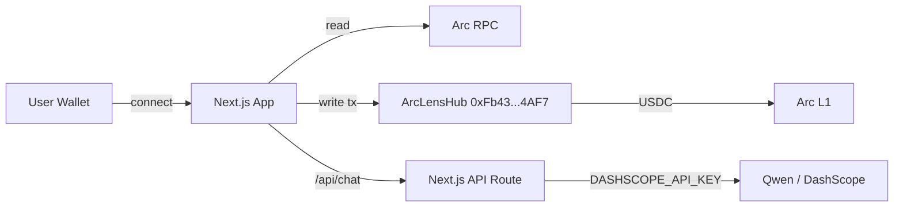

# 🔭 ArcLens

**A live network dashboard + AI guide for Arc L1 — built on native USDC.**

[](https://arc-lens-alpha.vercel.app/)
[](./LICENSE)
[](https://github.com/Abbagigo13/arc-lens/actions)
[](https://explorer.arc.io/address/0xFb430BbC236b2FAcDB11c81d79eE551DFad14AF7)

[Live App](https://arc-lens-alpha.vercel.app/) · [Report Bug](https://github.com/Abbagigo13/arc-lens/issues) · [Request Feature](https://github.com/Abbagigo13/arc-lens/issues)

</div>

---

## 📖 Overview

**ArcLens** is a full-stack dashboard and AI assistant for **Arc**, Circle's Layer 1 blockchain.
It combines real-time network data with a Qwen-powered AI guide, unlocked through a small
**0.01 USDC** on-chain payment — demonstrating USDC as a native payment primitive on Arc.

> ⚠️ **Mainnet notice:** ArcLens runs on Arc mainnet with **real USDC**.
> Test with the minimum amount (0.01 USDC). Not financial advice.

---

## ✨ Features

| Feature | Description |
| --- | --- |
| 🌐 **Live Network Pulse** | Real-time block number, gas (USDC), chain ID, activity |
| 🤖 **AI Guide (Qwen)** | Plain-English explanations with live dashboard context |
| 🔓 **USDC Unlock Paywall** | Pay 0.01 USDC via `unlock()`; status read on-chain |
| 💸 **Send** | Native USDC transfers |
| 🔄 **Mini Swap** | USDC → synthetic EURC credit (1:1) + redeem |
| 🔁 **Recurring Buy** | Interval-based USDC pulls, cancel + refund |
| 💬 **Chat Actions** | e.g. `swap 0.01 USDC`, `send 0.01 to me`, `recurring 0.01 every 60` |
| 🎨 **3D Landing** | Animated hero, feature grid, how-it-works |

---

## 🖼️ Screenshots

| Dashboard | AI Chat | Send / Swap |
| --- | --- | --- |
|  |  |  |

> 📹 **Demo video:** [Watch the 3-minute walkthrough](https://youtu.be/xxxx)

---

## 🏗️ Architecture



### Stack

- **Frontend:** Next.js (App Router), TypeScript, Tailwind, Framer Motion, React Three Fiber
- **Wallet:** wagmi / viem, multi-wallet connect + Arc chain switch
- **AI:** Qwen (`qwen-plus`) via DashScope, server-side only
- **Chain:** Arc L1 · native USDC (18 decimals)
- **Contract:** `ArcLensHub` — unlock, swap/redeem, recurring

---

## 🔗 Contract

| | |
| --- | --- |
| Network | Arc Mainnet |
| Address | `0xFb430BbC236b2FAcDB11c81d79eE551DFad14AF7` |
| Explorer | [View verified source](https://explorer.arc.io/address/0xFb430BbC236b2FAcDB11c81d79eE551DFad14AF7) |
| Unlock price | 0.01 USDC |
| Audit | Reviewed in Arc Studio (High/Med fixed) · **not third-party audited** |

---

## 🚀 Getting Started

### Prerequisites

- Node.js 18+
- npm / pnpm
- A wallet (MetaMask, Rabby, Coinbase Wallet, or WalletConnect)
- A DashScope API key → <https://dashscope.console.aliyun.com/>

### Install

```bash
git clone https://github.com/Abbagigo13/arc-lens.git
cd arc-lens
npm install
```

### Configure

```bash
cp .env.example .env.local
```

```env
DASHSCOPE_API_KEY=your_dashscope_api_key
NEXT_PUBLIC_ARC_HUB_ADDRESS=0xFb430BbC236b2FAcDB11c81d79eE551DFad14AF7
NEXT_PUBLIC_ARC_CHAIN_ID=your_arc_chain_id
```

### Run

```bash
npm run dev
# → http://localhost:3000
```

### Build

```bash
npm run build && npm start
```

---

## 📜 Scripts

| Script | Purpose |
| --- | --- |
| `npm run dev` | Local dev server |
| `npm run build` | Production build |
| `npm run lint` | ESLint |
| `npm run typecheck` | `tsc --noEmit` |
| `npm run test` | Unit + contract tests |
| `npm run test:e2e` | Playwright e2e |

---

## 🧪 Testing

```bash
npm run test          # unit + contract
npm run test:e2e      # e2e (unlock → send flow)
```

See [`docs/TEST_PLAN.md`](./docs/TEST_PLAN.md) for the full contract test plan.

---

## 🔒 Security

- ✅ AI keys live **only** in server routes; never exposed to the client
- ✅ The AI **never signs** — every tx requires explicit wallet confirmation
- ✅ Rate-limited chat endpoint (per IP + wallet)
- ✅ ReentrancyGuard / Pausable on `ArcLensHub`
- ✅ Contract source verified on explorer
- ⚠️ **Not formally audited** — do not use with large funds

Report issues: `security@[yourdomain]` or open a private advisory.

---

## 🗺️ Roadmap

- [ ] Testnet / demo mode with mocked data
- [ ] Third-party contract audit
- [ ] Multi-chain support (Base, Arbitrum)
- [ ] Portfolio + history view
- [ ] Mobile-optimized chat

---

## 🤝 Contributing

PRs welcome. See [`CONTRIBUTING.md`](./CONTRIBUTING.md) and
[open an issue](https://github.com/Abbagigo13/arc-lens/issues) first.

---

## 📄 License

[MIT](./LICENSE) © 2025 [Your Name]

---

## 🔗 Links

- **Arc:** <https://arc.network>
- **Docs:** <https://docs.arc.io>
- **Studio:** <https://studio.arc.io>
- **Live Hub:** <https://arc-lens-alpha.vercel.app/>

Built on Arc · Powered by native USDC · AI by Qwen
